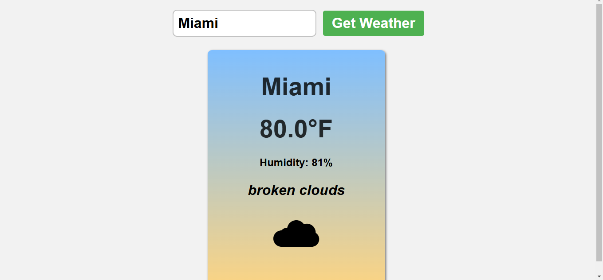
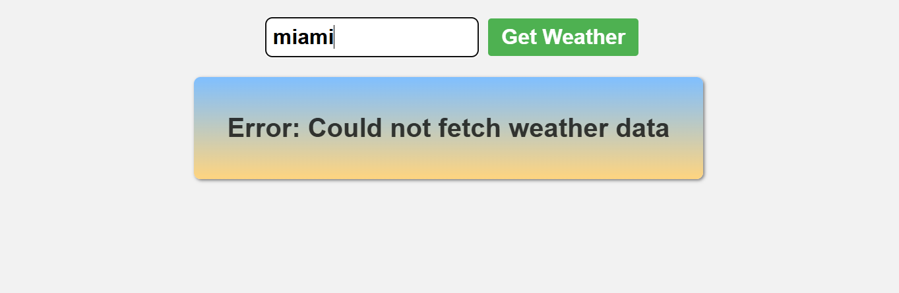

# Weather App 🌦️

A simple weather application that provides real-time weather information for any city around the globe. Built with HTML, CSS, and JavaScript, the app fetches weather data using the OpenWeatherMap API and displays it in a clean and responsive user interface.

## Features

- 🌍 **Search by City**: Enter any city name to fetch current weather details.
- 🌡️ **Weather Details**: Displays temperature, humidity, weather description, and a weather icon.
- 🎨 **Responsive Design**: User-friendly and adaptive to different screen sizes.
- 🔄 **Error Handling**: Handles errors gracefully with clear messages for invalid inputs or API failures.
- 🎭 **Dynamic Icons**: Displays emojis based on the current weather conditions.

## Table of Contents

- [Technologies Used](#technologies-used)
- [Setup Instructions](#setup-instructions)
- [Usage](#usage)
- [Screenshots](#screenshots)
- [Contributing](#contributing)

## Technologies Used

- **Frontend**: HTML5, CSS3, JavaScript (ES6+)
- **API**: [OpenWeatherMap API](https://openweathermap.org/api)
- **Styling**: Responsive design using pure CSS

## Setup Instructions

Follow these steps to run the app locally:

1. **Clone the Repository**:
   ```bash
   git clone https://github.com/ThasnimaShereef/Weather-App.git
   cd Weather-App

2. **Open the Project**:
   Open the project folder in your favorite code editor.

3. **API Key**:
   - Sign up at [OpenWeatherMap](https://openweathermap.org/) and obtain your API key.
   - Replace `YOUR API KEY` in `index.js` with your actual API key:
     ```javascript
     const apiKey = "YOUR_API_KEY";
     ```

4. **Launch the App**:
   - Open the `index.html` file in your browser to view the app.

## Usage

1. Enter the name of a city in the input field.
2. Click the "Get Weather" button to fetch the weather data.
3. The app will display:
   - Current temperature (in Fahrenheit)
   - Humidity percentage
   - Weather description
   - A weather emoji representing the conditions

## Screenshots

### Home Page


### Weather Results


### Error Message


## Contributing

Contributions are welcome! To contribute:

1. Fork this repository.
2. Create a feature branch:
   ```bash
   git checkout -b feature-name
   ```
3. Commit your changes:
   ```bash
   git commit -m "Add your message here"
   ```
4. Push to the branch:
   ```bash
   git push origin feature-name
   ```
5. Open a pull request.

### Acknowledgments

- Weather data provided by [OpenWeatherMap](https://openweathermap.org/).
- Icons and emojis inspired by weather conditions.
